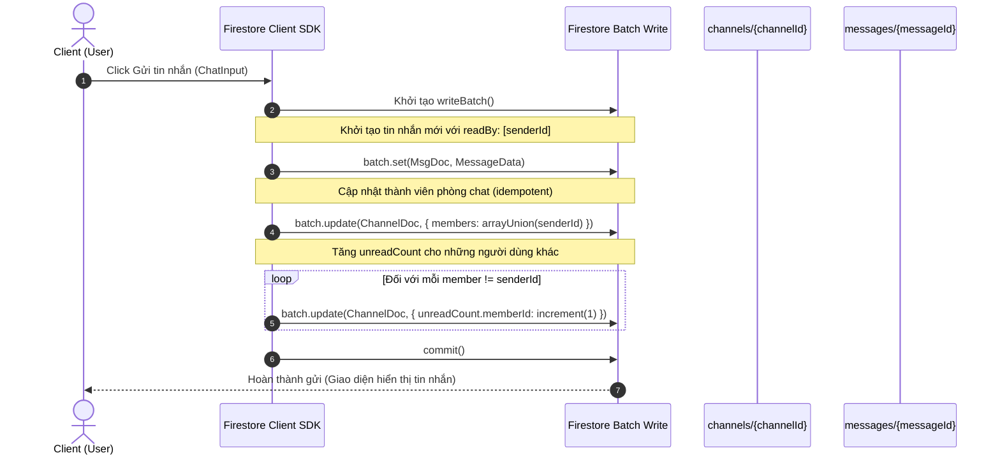
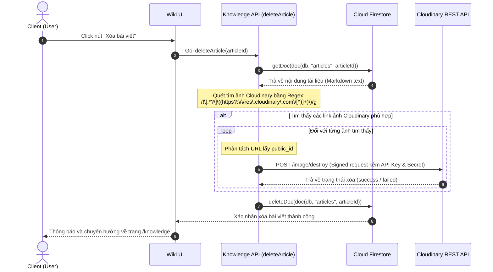

# Tài liệu Thiết kế Chi tiết / 詳細設計書 (Porocia Portal)

Tài liệu này trình bày thiết kế chi tiết (Detailed Design) các component React, custom hooks, cấu trúc API kết nối Firestore, và các luồng xử lý dữ liệu chi tiết của hệ thống **Porocia**.

---

## 1. Thiết kế Chi tiết các Component / UI Components Design

### 1.1 Phân hệ Xác thực & Trạng thái: `AuthProvider.tsx`
Component bọc (Context Provider) quản lý phiên đăng nhập của nhân viên trên toàn ứng dụng.
*   **Trạng thái quản lý (React State)**:
    *   `user`: `UserProfile | null` (Thông tin hồ sơ nhân viên đã đăng nhập thành công).
    *   `loading`: `boolean` (Trạng thái đang tải dữ liệu phiên lúc khởi tạo ứng dụng).
*   **Logic xử lý chính**:
    *   Sử dụng Firebase Auth `onAuthStateChanged` để theo dõi thay đổi phiên.
    *   Khi có `AuthUser` hợp lệ, component thực hiện gọi Firestore `getDoc(doc(db, "users", authUser.uid))` để lấy `UserProfile` (displayName, photoURL, bio, role) tương ứng.
    *   Nếu tài liệu người dùng chưa tồn tại (trường hợp đăng ký mới), hệ thống sẽ tự động tạo tài liệu người dùng với vai trò mặc định là `member` và lưu thông tin vào Firestore.
    *   Cung cấp `AuthContext.Provider` cho toàn bộ các trang con kế thừa.

---

### 1.2 Phân hệ Nhắn tin (Chat Module)

#### A. Màn hình điều khiển chính: `ChatPanel.tsx`
Quản lý luồng hiển thị tin nhắn của kênh đang active.
*   **Thuộc tính nhận vào (Props)**:
    *   `channelId`: `string` (ID của kênh chat đang mở).
*   **Trạng thái quản lý (States)**:
    *   `messages`: `ChatMessage[]` (Mảng tin nhắn tải thời gian thực).
    *   `loading`: `boolean` (Trạng thái tải tin nhắn lịch sử lần đầu).
    *   `replyingTo`: `ChatMessage | null` (Tin nhắn đang được chọn để phản hồi).
*   **Logic kết nối**:
    *   Khi `channelId` thay đổi, sử dụng custom hook `useChat(channelId)` để kết nối Real-time listener (`listenLatestMessages`).
    *   Tự động cuộn xuống đáy hộp thoại tin nhắn thông qua `ref` chỉ tới thẻ div trống ở cuối danh sách khi có tin nhắn mới.
    *   Tự động kích hoạt hàm `markChannelAsRead(channelId, user.uid)` để xóa số tin nhắn chưa đọc và cập nhật trạng thái đã đọc của chính mình.

#### B. Khung nhập liệu tin nhắn: `ChatInput.tsx`
*   **Thuộc tính nhận vào (Props)**:
    *   `channelId`: `string`
    *   `replyingTo`: `ChatMessage | null`
    *   `onCancelReply`: `() => void`
*   **Trạng thái quản lý (States)**:
    *   `text`: `string` (Nội dung văn bản đang nhập).
    *   `sending`: `boolean` (Trạng thái đang gửi tin để tắt nút submit tránh click đúp).
*   **Logic xử lý**:
    *   **Gửi tin nhắn**: Khi nhấn Enter (không giữ Shift) hoặc click nút Gửi:
        1. Gọi API `sendMessage({ channelId, text, senderId, senderEmail, senderName, senderPhotoURL, replyTo })`.
        2. Nếu đang ở chế độ phản hồi, truyền tham số `replyTo` chứa ID tin nhắn gốc, tên và nội dung tin gốc.
        3. Sau khi gửi thành công, reset trạng thái `text` về rỗng `""` và gọi `onCancelReply()`.

#### C. Thẻ hiển thị tin nhắn: `ChatBubble.tsx`
*   **Props**:
    *   `message`: `ChatMessage` (Đối tượng tin nhắn chi tiết).
    *   `isMe`: `boolean` (Xác định tin nhắn của chính mình để căn phải và đổi màu).
    *   `onReply`: `(msg: ChatMessage) => void` (Callback phản hồi tin nhắn).
*   **Trạng thái quản lý (States)**:
    *   `showReactionsPopup`: `boolean` (Hiển thị popup chọn nhanh emoji khi hover).
*   **Tính năng tích hợp**:
    *   **Phản hồi (Reply)**: Hiển thị một khung nhỏ phía trên tin nhắn hiển thị lại nội dung tin gốc mà tin này đang phản hồi (nếu có `message.replyTo`).
    *   **Cảm xúc (Reactions)**: Hiển thị danh sách các biểu tượng cảm xúc đã thả dưới tin nhắn kèm số lượng. Gọi hàm `toggleMessageReaction` để thả hoặc hủy thả emoji.
    *   **Đã đọc (Read Receipts)**: Nếu là tin nhắn do chính mình gửi, hiển thị nhãn `ReadReceiptLabel` đếm số lượng người đã đọc. Khi click vào nhãn, mở `ReadReceiptModal` gọi hàm `getUserProfiles(message.readBy)` để hiển thị chi tiết danh sách avatar và tên những nhân viên đã đọc tin này.

---

### 1.3 Phân hệ Lịch biểu (Calendar Module)

#### A. Component Lịch biểu Trung tâm: `PorociaCalendar.tsx`
Tích hợp động giữa thư viện lịch và thanh công cụ tùy biến.
*   **Component con tích hợp**:
    *   `MiniCalendar`: Lịch phụ ở thanh bên (Sidebar), đồng bộ ngày đang hiển thị với lịch chính.
    *   `CustomToolbar`: Thanh chuyển đổi Tháng / Tuần / Ngày / Lịch trình thiết kế theo Claude Theme.
*   **Trạng thái quản lý (States)**:
    *   `events`: `CalendarEvent[]` (Danh sách sự kiện đồng bộ real-time).
    *   `selectedDate`: `Date` (Ngày đang được chọn tập trung).
    *   `selectedEvent`: `CalendarEvent | null` (Sự kiện đang được click xem chi tiết).
    *   `showAddModal`: `boolean` (Trạng thái mở modal tạo sự kiện mới).
    *   `selectedSlot`: `{ start: Date; end: Date } | null` (Vùng chọn kéo thả trên lưới để tạo sự kiện nhanh).

#### B. Modal quản lý Sự kiện: `AddEventModal.tsx` & `EventDetailModal.tsx`
*   **`AddEventModal`**:
    *   Chứa Form cho phép nhập: Tiêu đề, Mô tả, Thời gian Bắt đầu & Kết thúc, Danh mục màu sắc (`회의`, `来客 / 外出`, `締切`, `イベント`), và công khai/nhóm/cá nhân (`scope`).
    *   Nếu chọn `scope === 'group'`, hiển thị thêm danh sách lựa chọn nhóm mà người dùng đang tham gia để gắn sự kiện vào nhóm đó.
    *   Hỗ trợ chế độ Sửa (Edit) sự kiện nếu người dùng hiện tại là Creator của sự kiện hoặc là Admin.
*   **`EventDetailModal`**:
    *   Hiển thị thông tin chi tiết sự kiện và nút "Xóa sự kiện" (chỉ hiển thị cho Creator hoặc Admin). Gọi hàm `deleteCalendarEvent` kèm confirm dialog tùy biến.

---

### 1.4 Trình tải hình ảnh: `ImageUploaderClient.tsx`
Component nút tải ảnh không đồng bộ được tích hợp trong trình soạn thảo Wiki Markdown.
*   **Props**:
    *   `onInsert`: `(markdownToken: string) => void`
*   **Trạng thái quản lý (States)**:
    *   `uploading`: `boolean` (Trạng thái đang gửi request upload lên Cloudinary).
*   **Quy trình Upload trực tiếp (Client Upload Flow)**:
    1. Người dùng click nút "Thêm ảnh", input file ẩn `accept="image/*"` kích hoạt chọn file.
    2. Sau khi chọn, gọi hàm `uploadToCloudinary(file)`:
       ```typescript
       const form = new FormData();
       form.append("file", file);
       form.append("upload_preset", NEXT_PUBLIC_CLOUDINARY_UPLOAD_PRESET);
       
       const res = await fetch(`https://api.cloudinary.com/v1_1/${NEXT_PUBLIC_CLOUDINARY_CLOUD_NAME}/image/upload`, {
         method: "POST",
         body: form
       });
       ```
    3. Phản hồi thành công trả về `data.secure_url`.
    4. Component trigger hàm `onInsert('')` để chèn chuỗi markdown vào vị trí con trỏ trong khung soạn thảo của Wiki.

---

## 2. Thông số API và Custom Hooks / API & Hooks Specs

### 2.1 Các Custom Hooks thời gian thực

#### `useChat(channelId: string)`
*   **Chức năng**: Quản lý tin nhắn thời gian thực của phòng chat đang mở.
*   **Giá trị trả về**:
    *   `messages`: `ChatMessage[]`
    *   `loading`: `boolean`
*   **Luồng xử lý**:
    *   Đăng ký lắng nghe Firestore qua `listenLatestMessages(channelId, (msgs) => setMessages(msgs))`.
    *   Khi hook unmount (người dùng rời phòng chat hoặc đổi kênh), tự động hủy lắng nghe (unsubscribe) thông qua hàm callback của `onSnapshot`.

#### `useChannels()`
*   **Chức năng**: Lắng nghe thay đổi danh sách kênh chat động.
*   **Giá trị trả về**:
    *   `channels`: `Channel[]`
    *   `loading`: `boolean`
*   **Luồng xử lý**:
    *   Lắng nghe toàn bộ tài liệu trong collection `channels` nơi mảng `members` có chứa UID người dùng (`where("members", "array-contains", uid)`).

---

### 2.2 Đặc tả hàm kết nối Firestore (Database API Helpers)

#### A. Phân hệ Chat: `lib/firebase/chat.ts`

```typescript
/**
 * Gửi tin nhắn mới vào phòng chat, cập nhật số tin chưa đọc bằng ghi Batch
 */
export async function sendMessage(params: {
  channelId: string;
  text: string;
  senderId: string;
  senderEmail: string;
  senderName: string;
  senderPhotoURL?: string;
  replyTo?: ChatMessage['replyTo'];
}): Promise<void>;

/**
 * Đánh dấu tin nhắn mới nhất là đã đọc, reset counter chưa đọc về 0
 */
export async function markChannelAsRead(channelId: string, uid: string): Promise<void>;

/**
 * Thả hoặc hủy thả cảm xúc emoji trên tin nhắn
 */
export async function toggleMessageReaction(params: {
  channelId: string;
  messageId: string;
  uid: string;
  emoji: string;
  isRemoving: boolean;
}): Promise<void>;

/**
 * Khởi tạo kênh chat DM giữa 2 người dùng (sắp xếp UID làm Document ID)
 */
export async function ensureDirectChannel(
  userA: { uid: string; displayName: string },
  userB: { uid: string; displayName: string }
): Promise<string>;
```

#### B. Phân hệ Lịch biểu: `lib/firebase/events.ts`

```typescript
/**
 * Lưu sự kiện lịch biểu mới
 */
export async function addCalendarEvent(event: Omit<CalendarEvent, "id" | "createdAt">): Promise<string>;

/**
 * Lắng nghe thay đổi sự kiện lịch biểu (đồng bộ real-time lên giao diện)
 */
export function subscribeToEvents(callback: (events: CalendarEvent[]) => void): () => void;

/**
 * Cập nhật thông tin sự kiện
 */
export async function updateCalendarEvent(id: string, updates: Partial<Omit<CalendarEvent, "id" | "createdAt">>): Promise<void>;

/**
 * Xóa sự kiện khỏi hệ thống
 */
export async function deleteCalendarEvent(id: string): Promise<void>;
```

#### C. Phân hệ Thư viện tài liệu (Wiki): `lib/firebase/knowledge.ts`

```typescript
/**
 * Tạo bài viết Markdown mới
 */
export async function createArticle(data: Omit<Article, "views" | "likes" | "createdAt" | "updatedAt">): Promise<string>;

/**
 * Cập nhật bài viết Markdown
 */
export async function updateArticle(articleId: string, data: Partial<Omit<Article, "id" | "views" | "likes" | "createdAt" | "updatedAt">>): Promise<void>;

/**
 * Xóa bài viết và tự động gọi API dọn dẹp ảnh trên Cloudinary
 */
export async function deleteArticle(articleId: string): Promise<void>;

/**
 * Tăng số lượt đọc bài viết (sử dụng Firestore increment)
 */
export async function incrementViews(articleId: string): Promise<void>;

/**
 * Thích hoặc bỏ thích bài viết tài liệu
 */
export async function toggleLikeArticle(articleId: string, uid: string, isLiked: boolean): Promise<void>;
```

---

## 3. Luồng Nghiệp vụ cấp độ Code / Sequence Flows

### 3.1 Luồng Gửi Tin Nhắn & Cập nhật Trạng thái Chưa đọc (Real-time Message & Unread State)

Sử dụng `writeBatch` của Firestore để đảm bảo tất cả các cập nhật dữ liệu xảy ra đồng thời hoặc không xảy ra gì (Tính nguyên tử - Atomicity).



---

### 3.2 Luồng Tải và Dọn dẹp Ảnh khi xóa bài viết Wiki (Cloudinary Cleanup Workflow)

Khi quản trị viên hoặc tác giả xóa một tài liệu Markdown trong Wiki, hệ thống sẽ thực hiện dọn dẹp các tệp ảnh đã upload lên Cloudinary để giải phóng dung lượng, tránh rác dữ liệu.



---

## 4. Cơ chế Bảo mật & Phân quyền Lọc dữ liệu / Privacy Enforcement

Hệ thống thiết lập bộ lọc dữ liệu chặt chẽ cả ở tầng Client (phục vụ UX) và tầng Firestore (phục vụ bảo mật thực tế).

### 4.1 Lọc hiển thị Lịch biểu (Calendar Filter Logic)
Để đảm bảo lịch biểu cá nhân không bị lộ cho người dùng khác:
*   **Tầng Client**: Khi fetch dữ liệu lịch biểu thời gian thực từ Firestore (`subscribeToEvents`), hook sẽ áp dụng logic lọc ở phía client:
    ```typescript
    const filteredEvents = allEvents.filter(event => {
      // 1. Nếu là sự kiện toàn công ty, hiển thị cho mọi người
      if (event.scope === 'company') return true;
      
      // 2. Nếu là sự kiện nhóm, chỉ hiển thị nếu user là member của nhóm hoặc là Admin
      if (event.scope === 'group') {
        return userGroups.includes(event.groupId) || userRole === 'admin';
      }
      
      // 3. Nếu là sự kiện cá nhân, chỉ hiển thị nếu chính mình tạo ra
      if (event.scope === 'personal') {
        return event.createdBy === user.uid;
      }
      
      return false;
    });
    ```

### 4.2 Bảo vệ phân quyền Thư viện tài liệu (Knowledge Base Restriction)
Tương tự, các bài viết có scope giới hạn được bảo vệ nghiêm ngặt:
*   **Bài viết nhóm (group)**: Khi người dùng xem trang `/knowledge/[articleId]`, trước khi hiển thị chi tiết, Component kiểm tra xem `article.scope === 'group'` thì tài khoản có thuộc mảng `article.allowedGroups` hay không. Nếu không, hiển thị màn hình cảnh báo truy cập trái phép và chặn hiển thị dữ liệu bài viết.
*   **Bài viết Admin-only**: Chỉ hiển thị và cho phép chỉnh sửa nếu tài khoản hiện tại có `user.role === 'admin'`.

---
*Tài liệu thiết kế chi tiết được cập nhật vào ngày 2026-06-01*
