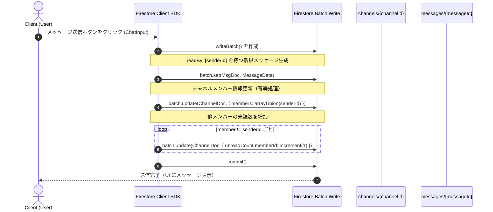
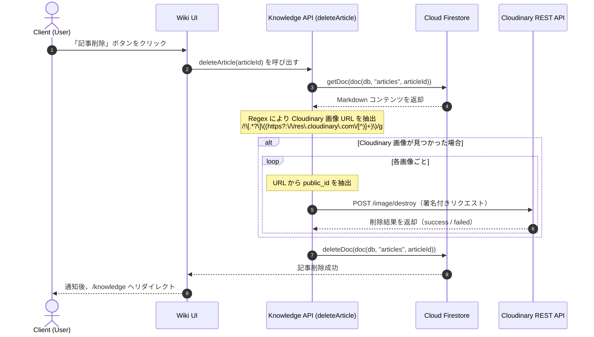

# 詳細設計書 (Porocia Portal)

本書は、**Porocia** システムにおける React コンポーネント、カスタムフック、Firestore 連携 API 構造、および詳細なデータ処理フローの詳細設計（Detailed Design）を記載する。

---

## 1. コンポーネント詳細設計 / UI Components Design

### 1.1 認証・セッション管理モジュール: `AuthProvider.tsx`

従業員のログインセッションをアプリケーション全体で管理するラッパーコンポーネント（Context Provider）。

* **管理状態（React State）**

  * `user`: `UserProfile | null`（ログイン済み従業員のプロフィール情報）
  * `loading`: `boolean`（アプリケーション初期化時のセッション読込状態）

* **主要処理ロジック**

  * Firebase Auth の `onAuthStateChanged` を利用して認証状態の変更を監視する。
  * 有効な `AuthUser` が存在する場合、Firestore の `getDoc(doc(db, "users", authUser.uid))` を呼び出し、対応する `UserProfile`（displayName、photoURL、bio、role）を取得する。
  * ユーザードキュメントが存在しない場合（新規登録時）は、デフォルト権限を `member` としてユーザードキュメントを自動生成し、Firestore に保存する。
  * `AuthContext.Provider` を通じて、全ての子コンポーネントへ認証情報を提供する。

---

### 1.2 チャットモジュール (Chat Module)

#### A. メイン画面コンポーネント: `ChatPanel.tsx`

アクティブなチャネルのメッセージ表示フローを管理する。

* **入力プロパティ（Props）**

  * `channelId`: `string`（現在開いているチャットチャネルの ID）

* **管理状態（States）**

  * `messages`: `ChatMessage[]`（リアルタイムで取得したメッセージ配列）
  * `loading`: `boolean`（初回履歴メッセージ読込状態）
  * `replyingTo`: `ChatMessage | null`（返信対象として選択中のメッセージ）

* **接続ロジック**

  * `channelId` が変更された際、カスタムフック `useChat(channelId)` を利用してリアルタイムリスナー（`listenLatestMessages`）へ接続する。
  * 新しいメッセージが到着した際、リスト末尾の空の div を参照する `ref` を利用して自動スクロールを実行する。
  * `markChannelAsRead(channelId, user.uid)` を自動実行し、未読数のリセットおよび既読状態の更新を行う。

#### B. メッセージ入力コンポーネント: `ChatInput.tsx`

* **入力プロパティ（Props）**

  * `channelId`: `string`
  * `replyingTo`: `ChatMessage | null`
  * `onCancelReply`: `() => void`

* **管理状態（States）**

  * `text`: `string`（入力中のテキスト内容）
  * `sending`: `boolean`（送信中状態。二重送信防止のため送信ボタンを無効化）

* **処理ロジック**

  * **メッセージ送信**
    Enter キー（Shift なし）または送信ボタン押下時：

    1. `sendMessage({ channelId, text, senderId, senderEmail, senderName, senderPhotoURL, replyTo })` を呼び出す。
    2. 返信モードの場合、元メッセージの ID・送信者名・本文を含む `replyTo` を渡す。
    3. 送信成功後、`text` を空文字列 `""` にリセットし、`onCancelReply()` を実行する。

#### C. メッセージ表示コンポーネント: `ChatBubble.tsx`

* **Props**

  * `message`: `ChatMessage`（メッセージオブジェクト）
  * `isMe`: `boolean`（自身のメッセージかどうかを判定し、右寄せ・色変更を行う）
  * `onReply`: `(msg: ChatMessage) => void`（返信コールバック）

* **管理状態（States）**

  * `showReactionsPopup`: `boolean`（ホバー時の絵文字選択ポップアップ表示状態）

* **統合機能**

  * **返信（Reply）**
    `message.replyTo` が存在する場合、元メッセージ内容を表示する小さな引用エリアを表示する。

  * **リアクション（Reactions）**
    メッセージ下部にリアクション絵文字と件数を表示する。
    `toggleMessageReaction` を呼び出してリアクションの追加・削除を行う。

  * **既読確認（Read Receipts）**
    自身が送信したメッセージの場合、既読人数を表示する `ReadReceiptLabel` を表示する。
    ラベルクリック時に `ReadReceiptModal` を開き、`getUserProfiles(message.readBy)` を利用して既読ユーザーのアバターと氏名一覧を表示する。

---

### 1.3 カレンダーモジュール (Calendar Module)

#### A. メインカレンダーコンポーネント: `PorociaCalendar.tsx`

カレンダーライブラリとカスタムツールバーを動的に統合する。

* **統合コンポーネント**

  * `MiniCalendar`
    サイドバーに表示される補助カレンダー。メインカレンダーと表示日を同期する。
  * `CustomToolbar`
    Claude Theme ベースで設計された月・週・日・スケジュール切替ツールバー。

* **管理状態（States）**

  * `events`: `CalendarEvent[]`（リアルタイム同期されたイベント一覧）
  * `selectedDate`: `Date`（現在選択中の日付）
  * `selectedEvent`: `CalendarEvent | null`（詳細表示中のイベント）
  * `showAddModal`: `boolean`（新規イベント作成モーダル表示状態）
  * `selectedSlot`: `{ start: Date; end: Date } | null`（ドラッグ選択された時間範囲）

#### B. イベント管理モーダル: `AddEventModal.tsx` & `EventDetailModal.tsx`

* **`AddEventModal`**

  * タイトル、説明、開始日時、終了日時、カテゴリカラー（`会議`、`来客 / 外出`、`締切`、`イベント`）、公開範囲（`scope`）を入力可能。
  * `scope === 'group'` の場合、ユーザーが所属するグループ一覧を表示し、イベントを紐付けできる。
  * 現在のユーザーがイベント作成者または管理者の場合、編集モードをサポートする。

* **`EventDetailModal`**

  * イベント詳細情報を表示する。
  * 「イベント削除」ボタンは作成者または管理者のみ表示する。
  * カスタム確認ダイアログ付きで `deleteCalendarEvent` を呼び出す。

---

### 1.4 画像アップロードコンポーネント: `ImageUploaderClient.tsx`

Wiki Markdown エディタに統合された非同期画像アップロードボタンコンポーネント。

* **Props**

  * `onInsert`: `(markdownToken: string) => void`

* **管理状態（States）**

  * `uploading`: `boolean`（Cloudinary へのアップロード処理中状態）

* **直接アップロードフロー（Client Upload Flow）**

  1. ユーザーが「画像追加」ボタンをクリックすると、`accept="image/*"` を設定した非表示ファイル入力が起動する。
  2. ファイル選択後、`uploadToCloudinary(file)` を呼び出す。

  ```typescript
  const form = new FormData();
  form.append("file", file);
  form.append("upload_preset", NEXT_PUBLIC_CLOUDINARY_UPLOAD_PRESET);

  const res = await fetch(`https://api.cloudinary.com/v1_1/${NEXT_PUBLIC_CLOUDINARY_CLOUD_NAME}/image/upload`, {
    method: "POST",
    body: form
  });
  ```

  3. アップロード成功時、`data.secure_url` を取得する。
  4. `onInsert('')` を実行し、Wiki エディタのカーソル位置へ Markdown 文字列を挿入する。

---

## 2. API およびカスタムフック仕様 / API & Hooks Specs

### 2.1 リアルタイムカスタムフック

#### `useChat(channelId: string)`

* **機能**

  * 開いているチャットルームのリアルタイムメッセージ管理。

* **戻り値**

  * `messages`: `ChatMessage[]`
  * `loading`: `boolean`

* **処理フロー**

  * `listenLatestMessages(channelId, (msgs) => setMessages(msgs))` を利用して Firestore リスナーを登録する。
  * フックのアンマウント時（チャット退出やチャネル変更時）、`onSnapshot` が返す unsubscribe 関数を利用して自動解除する。

#### `useChannels()`

* **機能**

  * チャットチャネル一覧の変更をリアルタイム監視する。

* **戻り値**

  * `channels`: `Channel[]`
  * `loading`: `boolean`

* **処理フロー**

  * `channels` コレクション内で、`members` 配列に現在ユーザーの UID を含むドキュメントを監視する。

---

### 2.2 Firestore 接続関数仕様（Database API Helpers）

#### A. チャットモジュール: `lib/firebase/chat.ts`

```typescript
/**
 * 新規メッセージを送信し、Batch 書き込みで未読数を更新する
 */
export async function sendMessage(params: {
  channelId: string;
  text: string;
  senderId: string;
  senderEmail: string;
  senderName: string;
  senderPhotoURL?: string;
  replyTo?: ChatMessage['replyTo'];
}): Promise<void>;

/**
 * 最新メッセージを既読にし、未読カウンターを 0 にリセットする
 */
export async function markChannelAsRead(channelId: string, uid: string): Promise<void>;

/**
 * メッセージへの絵文字リアクションを追加・削除する
 */
export async function toggleMessageReaction(params: {
  channelId: string;
  messageId: string;
  uid: string;
  emoji: string;
  isRemoving: boolean;
}): Promise<void>;

/**
 * 2 ユーザー間の DM チャネルを生成する
 * （UID をソートして Document ID とする）
 */
export async function ensureDirectChannel(
  userA: { uid: string; displayName: string },
  userB: { uid: string; displayName: string }
): Promise<string>;
```

#### B. カレンダーモジュール: `lib/firebase/events.ts`

```typescript
/**
 * 新規カレンダーイベントを保存する
 */
export async function addCalendarEvent(event: Omit<CalendarEvent, "id" | "createdAt">): Promise<string>;

/**
 * カレンダーイベントの変更を監視する
 * （リアルタイム同期）
 */
export function subscribeToEvents(callback: (events: CalendarEvent[]) => void): () => void;

/**
 * イベント情報を更新する
 */
export async function updateCalendarEvent(id: string, updates: Partial<Omit<CalendarEvent, "id" | "createdAt">>): Promise<void>;

/**
 * イベントを削除する
 */
export async function deleteCalendarEvent(id: string): Promise<void>;
```

#### C. ナレッジベース（Wiki）モジュール: `lib/firebase/knowledge.ts`

```typescript
/**
 * 新しい Markdown 記事を作成する
 */
export async function createArticle(data: Omit<Article, "views" | "likes" | "createdAt" | "updatedAt">): Promise<string>;

/**
 * Markdown 記事を更新する
 */
export async function updateArticle(articleId: string, data: Partial<Omit<Article, "id" | "views" | "likes" | "createdAt" | "updatedAt">>): Promise<void>;

/**
 * 記事を削除し、Cloudinary 上の画像も自動削除する
 */
export async function deleteArticle(articleId: string): Promise<void>;

/**
 * 記事閲覧数を増加させる
 * （Firestore increment 使用）
 */
export async function incrementViews(articleId: string): Promise<void>;

/**
 * 記事への「いいね」を追加・解除する
 */
export async function toggleLikeArticle(articleId: string, uid: string, isLiked: boolean): Promise<void>;
```

---

## 3. コードレベル業務フロー / Sequence Flows

### 3.1 メッセージ送信と未読状態更新フロー（Real-time Message & Unread State）

Firestore の `writeBatch` を利用し、全ての更新を原子的（Atomic）に実行する。



---

### 3.2 Wiki 記事削除時の画像削除フロー（Cloudinary Cleanup Workflow）

管理者または記事作成者が Markdown 記事を削除する際、Cloudinary 上の画像も削除し、不要データを防止する。



---

## 4. セキュリティおよび権限制御 / Privacy Enforcement

本システムは、UX 向上のためのクライアント側フィルタリングと、実際のセキュリティを担保する Firestore 側制御の両方を実施する。

### 4.1 カレンダー表示フィルタリングロジック

個人予定が他ユーザーへ公開されないようにするため：

* **クライアント側**
  `subscribeToEvents` によって取得したイベントを以下のロジックでフィルタリングする。

```typescript
const filteredEvents = allEvents.filter(event => {
  if (event.scope === 'company') return true;

  if (event.scope === 'group') {
    return userGroups.includes(event.groupId) || userRole === 'admin';
  }

  if (event.scope === 'personal') {
    return event.createdBy === user.uid;
  }

  return false;
});
```

### 4.2 ナレッジベース権限制御

制限付き記事についても厳格にアクセス制御を行う。

* **グループ記事（group）**
  ユーザーが `/knowledge/[articleId]` を開いた際、`article.scope === 'group'` の場合は `article.allowedGroups` に所属しているか確認する。
  所属していない場合はアクセス拒否画面を表示し、記事データの表示を禁止する。

* **管理者限定記事（Admin-only）**
  現在のユーザーの `user.role === 'admin'` の場合のみ閲覧および編集を許可する。

---

*詳細設計書更新日: 2026-06-01*
