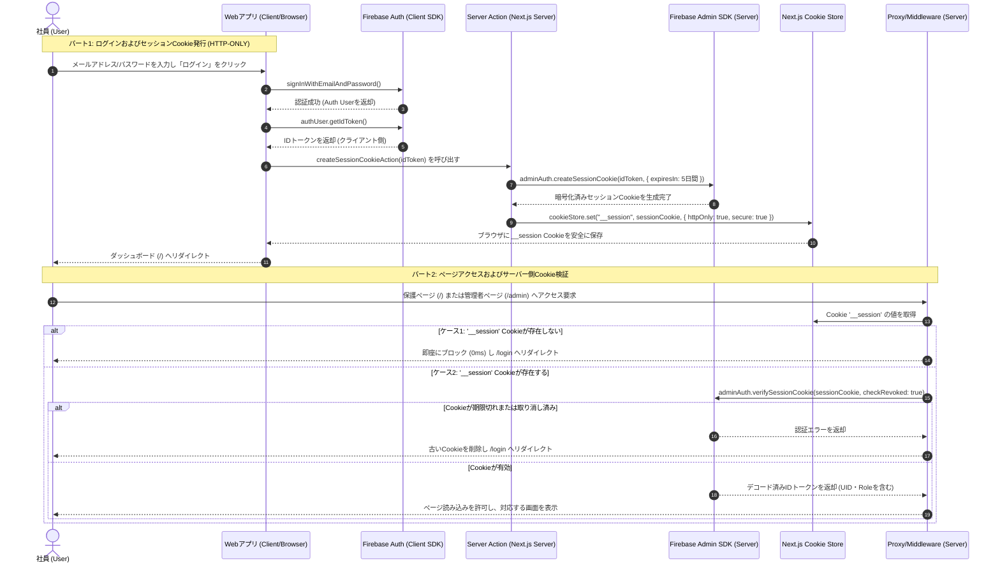
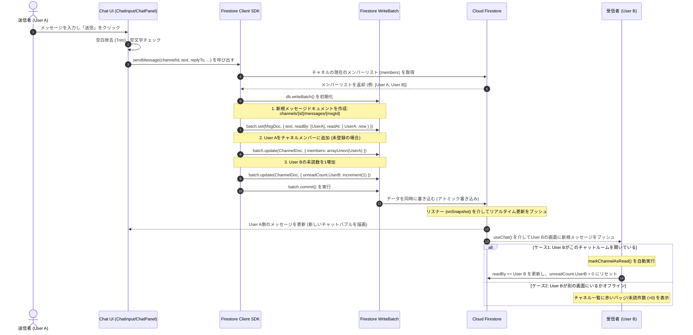
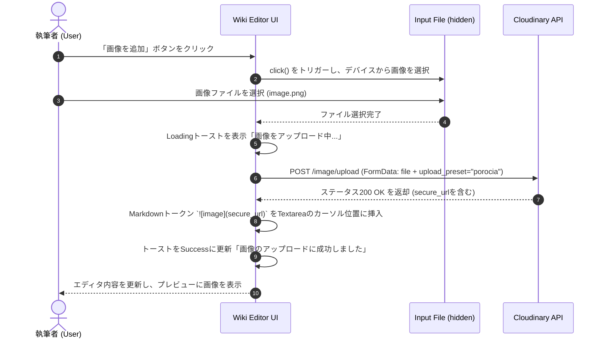
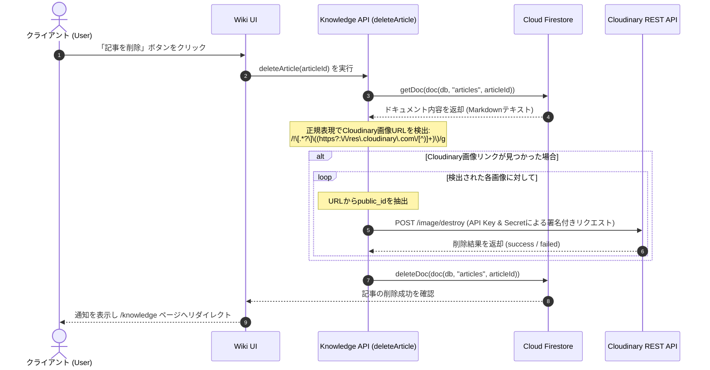
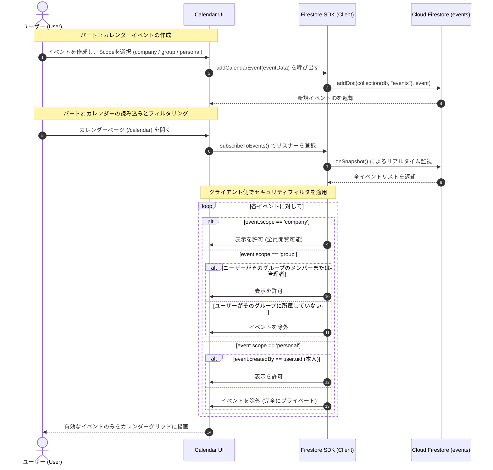
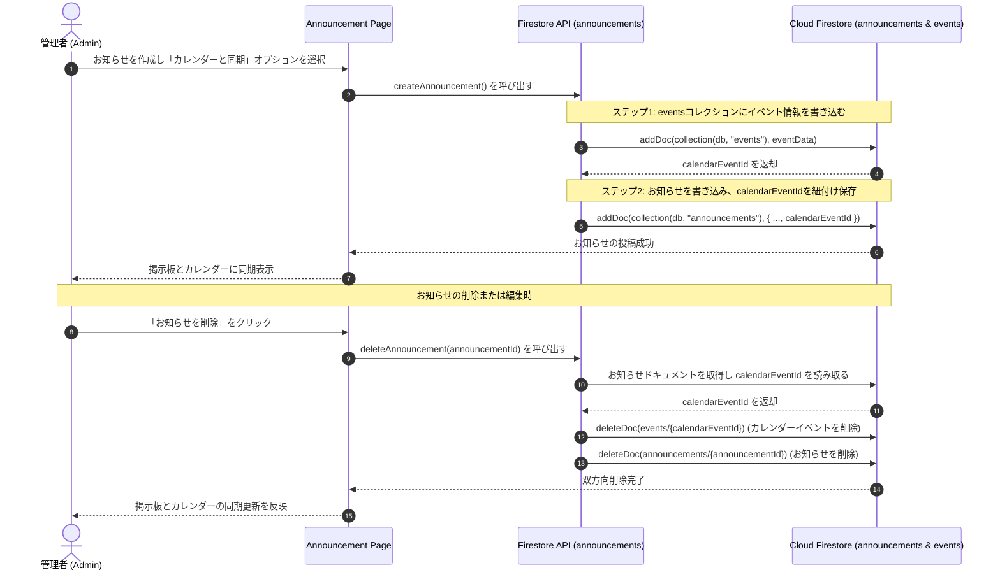
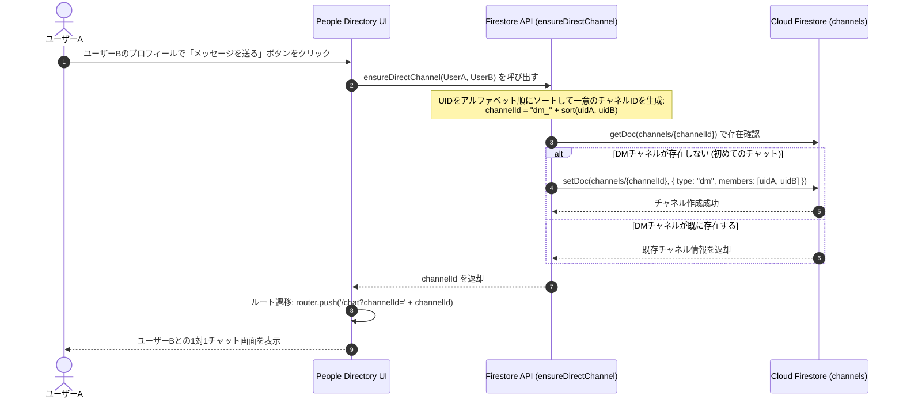

# システムフロー図 / 業務フロー一覧 (Porocia Portal)

本書は、**Porocia** システムにおける全ての主要な業務フローおよびデータ処理フローを網羅的にまとめたものです。各フローの **Mermaid** コードをそのまま **Draw.io** にコピー＆ペーストし（**`+` (Insert) → Advanced → Mermaid...**）、編集可能なシーケンス図として出力できます。

---

## 1. 認証およびセッションCookie発行フロー (Auth & Session Cookie Flow)
クライアント側でのログイン処理、IDトークンの取得、Server Actionを介したHTTP-onlyセッションCookieの発行、およびMiddleware/Serverによるルートガードの検証プロセスを示します。

---

## 2. メッセージ送信および未読数更新フロー (Message Sending & Unread Flow)
メッセージ送信、チャネルメンバーリストの更新、およびFirestoreのアトミックBatch書き込みによる未読カウンターの自動増加処理を示します。

---

## 3. Wiki画像の直接アップロードフロー (Wiki Image Upload Flow)
クライアントからCloudinaryへのUnsigned Presetを使用した直接ファイルアップロード、およびエディタのカーソル位置へのMarkdownトークン挿入プロセスをToast通知とともに示します。

---

## 4. Wiki記事削除時の画像クリーンアップフロー (Wiki Deletion Cleanup Flow)
Wiki記事のMarkdown本文を解析し、Cloudinaryに保存されている添付画像を特定・削除することでストレージの最適化を行うプロセスを示します。

---

## 5. カレンダーイベント作成および表示スコープフィルタリングフロー (Calendar Event Visibility Flow)
異なるScope（公開範囲）でのカレンダーイベント作成と、個人情報・グループ情報の機密性を保護するためのクライアント側フィルタリングメカニズムを示します。

---

## 6. お知らせとカレンダー連携フロー (Announcement & Calendar Event Sync Flow)
お知らせ（Announcement）の作成とカレンダーイベント（Calendar Event）の自動連携、および更新・削除時の双方向同期メカニズムを示します。

---

## 7. 1対1ダイレクトメッセージチャネル確立フロー (Direct Messaging 1-1 Provisioning Flow)
社員名簿やプロフィールページからDMチャネルを自動確認・初期化し、1対1のチャット画面へ遷移するプロセスを示します。

---
*システムフロー図更新日: 2026年06月01日*
