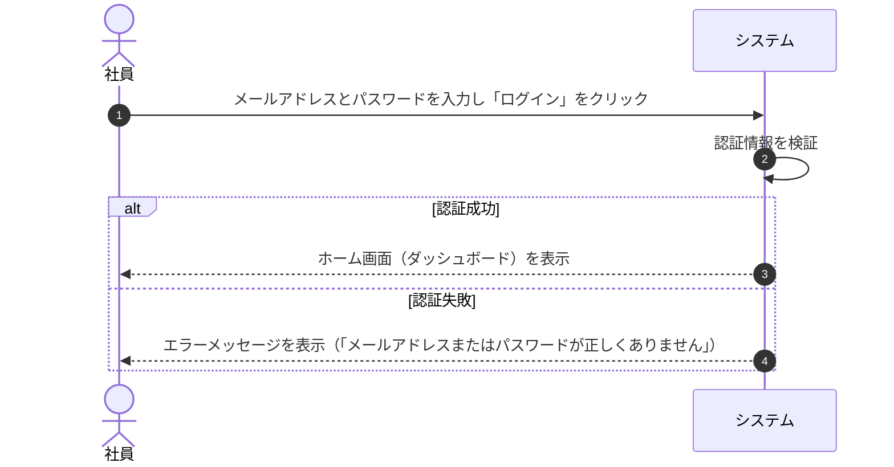
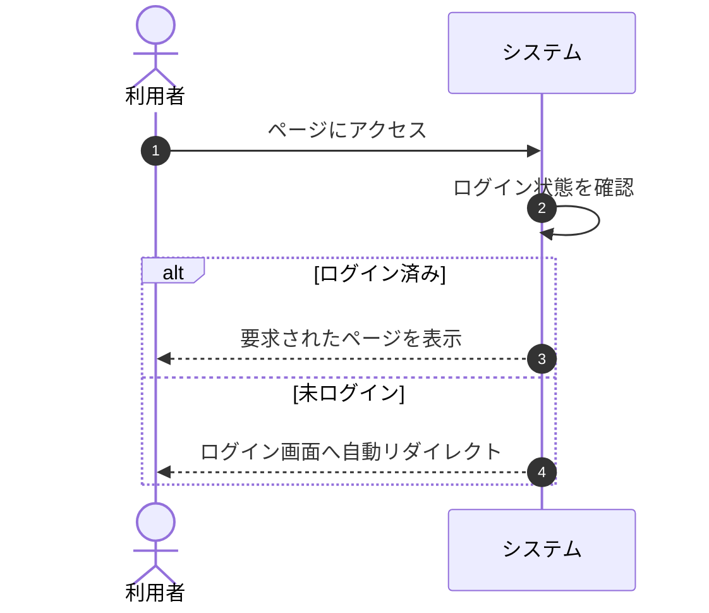
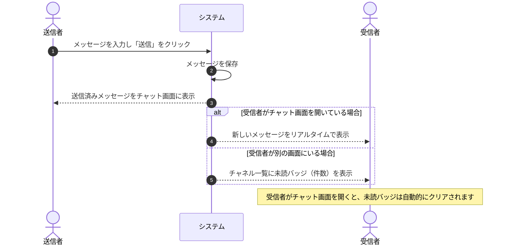
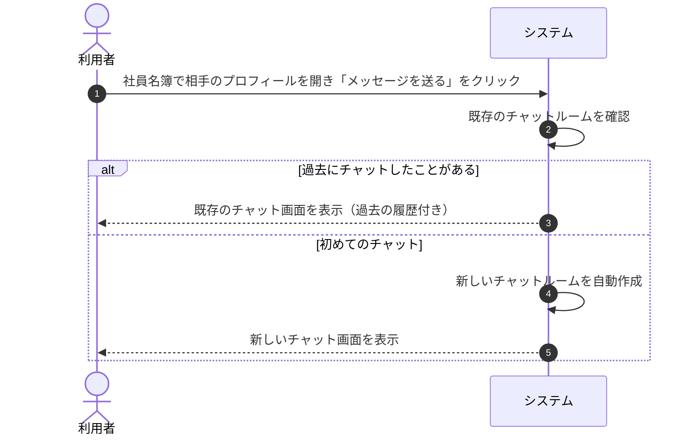
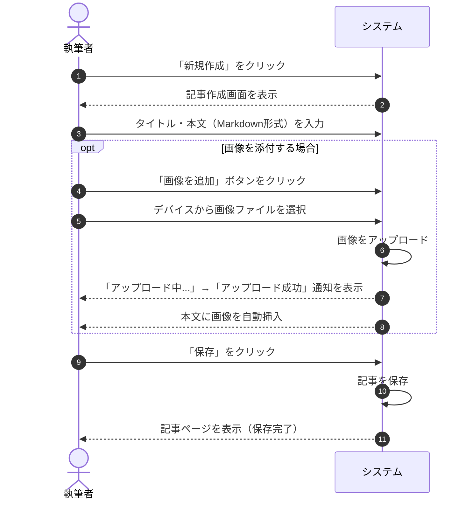
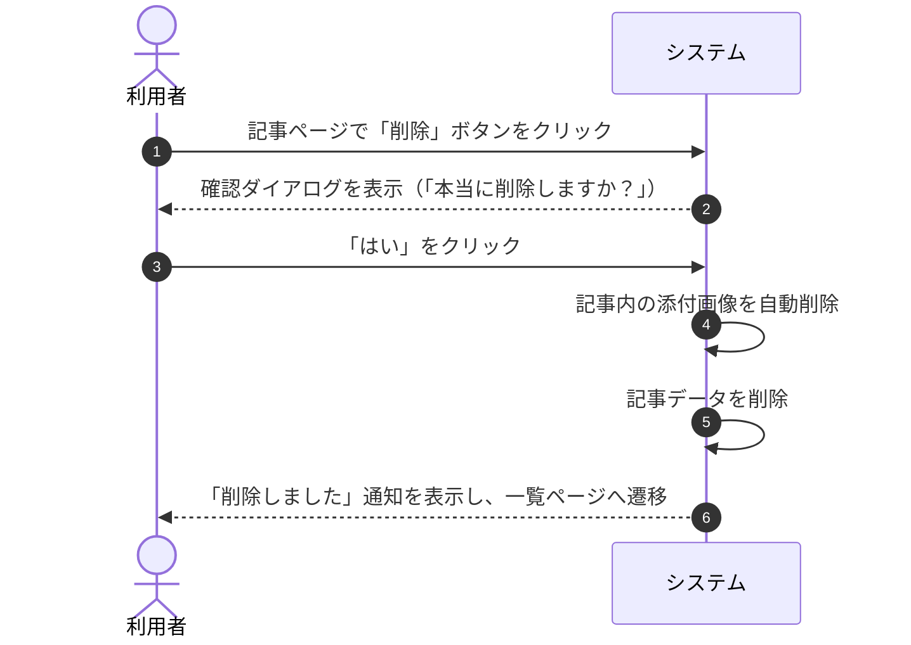
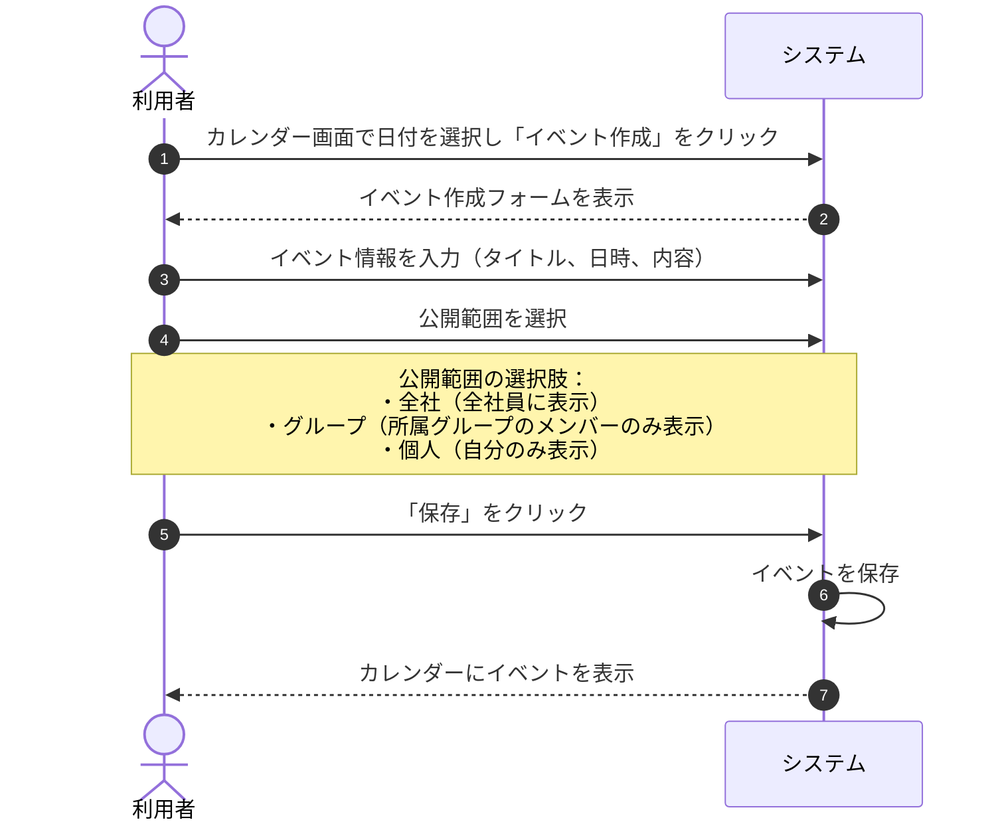
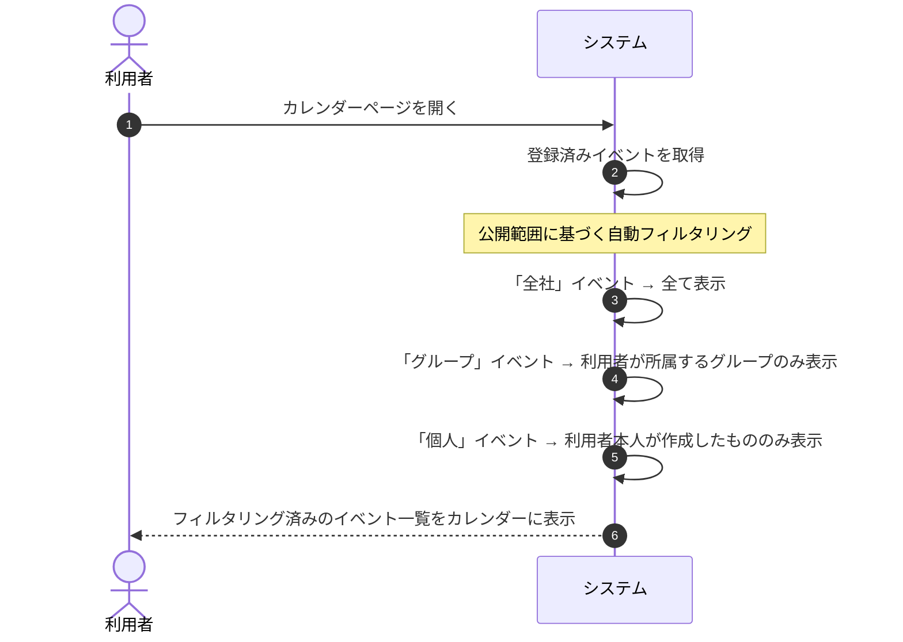
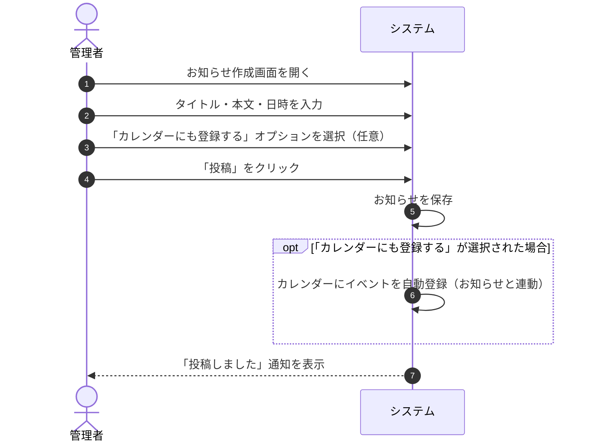
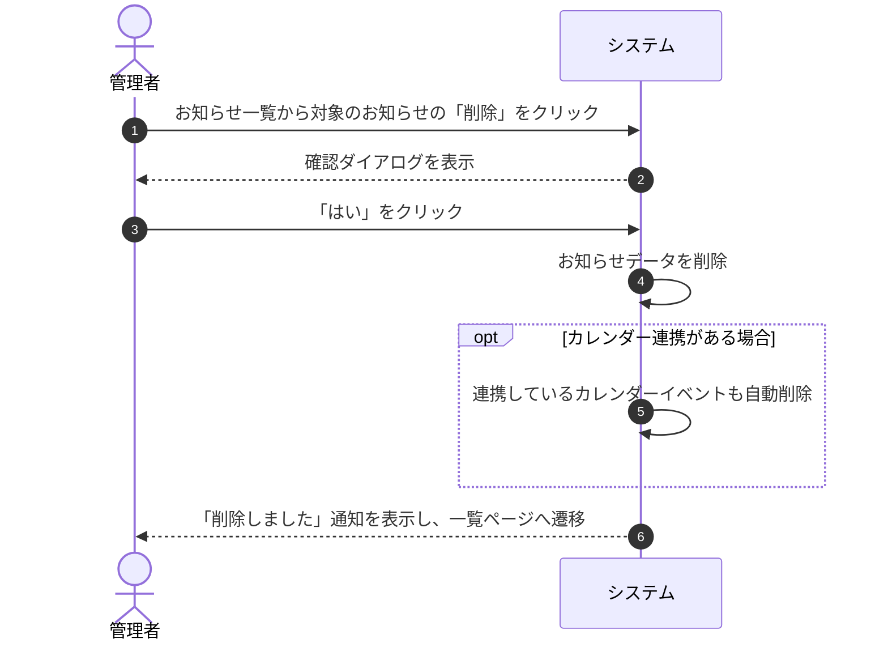

# 業務フロー一覧 (Porocia Portal)

本書は、**Porocia** ポータルシステムの主要な業務フローをまとめたものです。  
各フローは、利用者の操作とシステムの応答を中心に記載しています。

---

## 1. ログインフロー

社員がシステムにログインし、ホーム画面にアクセスするまでの流れを示します。

---

## 2. ページアクセス制御フロー

ログイン済みユーザーと未ログインユーザーがページにアクセスした際の振り分けを示します。

---

## 3. チャット（メッセージ送信）フロー

社員同士がチャット機能を利用してメッセージをやり取りする流れを示します。

---

## 4. ダイレクトメッセージ（1対1チャット）開始フロー

社員名簿から特定の相手を選び、1対1のチャットを開始する流れを示します。

---

## 5. ナレッジベース（Wiki）記事作成フロー

社員がナレッジベースに新しい記事を作成する流れを示します。画像の添付にも対応しています。

---

## 6. ナレッジベース（Wiki）記事削除フロー

記事を削除する際、添付画像も自動的にクリーンアップされる流れを示します。

---

## 7. カレンダーイベント作成フロー

カレンダーにイベントを登録する流れを示します。公開範囲（スコープ）の設定により、表示される対象が異なります。

---

## 8. カレンダー表示と公開範囲フィルタリングフロー

カレンダーを開いた際に、公開範囲に応じて表示されるイベントが自動的にフィルタリングされる仕組みを示します。

---

## 9. お知らせ作成・カレンダー連携フロー

管理者がお知らせを作成し、任意でカレンダーにも自動登録する流れを示します。

---

## 10. お知らせ削除時のカレンダー連動フロー

お知らせを削除すると、連携しているカレンダーイベントも自動的に削除される流れを示します。

---

## フロー一覧サマリー

| No. | フロー名 | 主な利用者 | 概要 |
|-----|---------|-----------|------|
| 1 | ログイン | 全社員 | メール/パスワードでシステムにログイン |
| 2 | ページアクセス制御 | 全社員 | 未ログイン時は自動的にログイン画面へ誘導 |
| 3 | チャット（メッセージ送信） | 全社員 | リアルタイムメッセージ送受信と未読管理 |
| 4 | ダイレクトメッセージ開始 | 全社員 | 社員名簿から1対1チャットを開始 |
| 5 | ナレッジベース記事作成 | 全社員 | Markdown形式で記事を作成、画像添付対応 |
| 6 | ナレッジベース記事削除 | 全社員 | 記事と添付画像の一括削除 |
| 7 | カレンダーイベント作成 | 全社員 | 公開範囲を指定してイベントを登録 |
| 8 | カレンダー表示フィルタリング | 全社員 | 公開範囲に応じた自動フィルタリング表示 |
| 9 | お知らせ作成・カレンダー連携 | 管理者 | お知らせ投稿とカレンダー自動登録 |
| 10 | お知らせ削除・カレンダー連動 | 管理者 | お知らせ削除時のカレンダー自動連動削除 |

---

*業務フロー更新日: 2026年06月01日*
