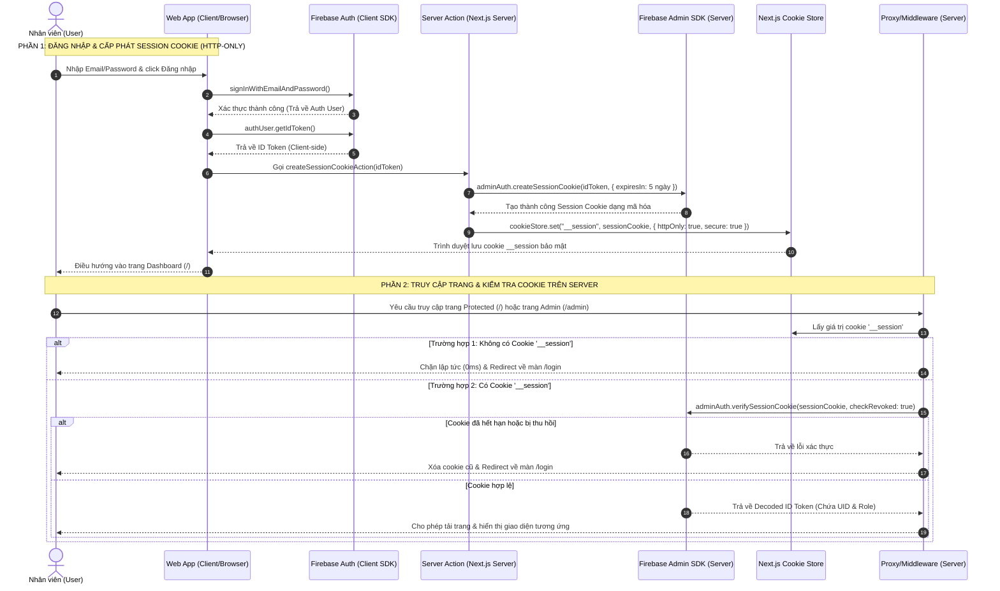
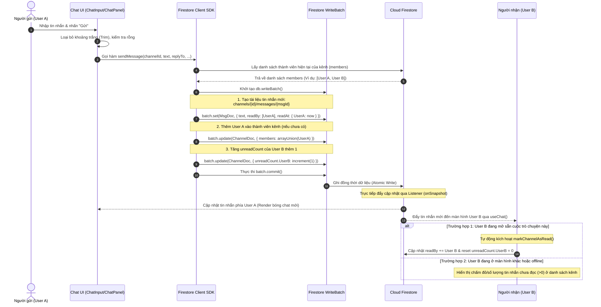
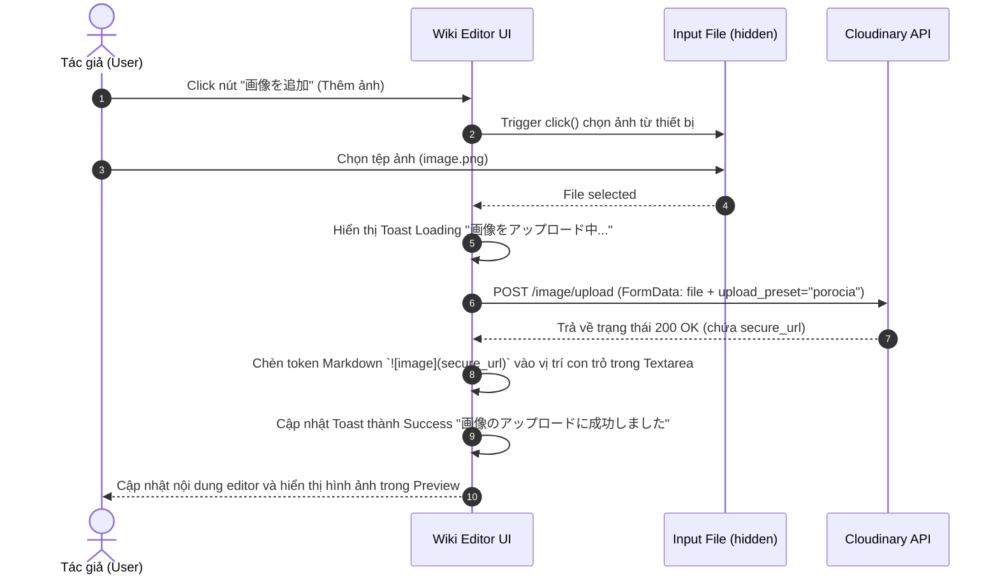
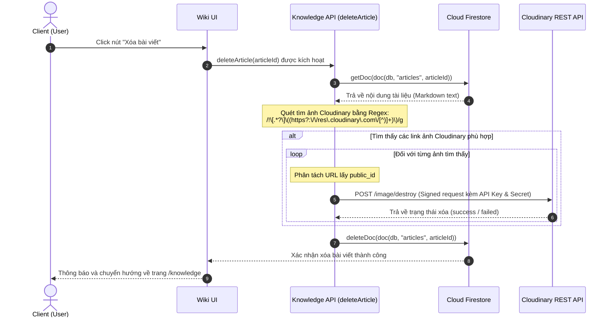
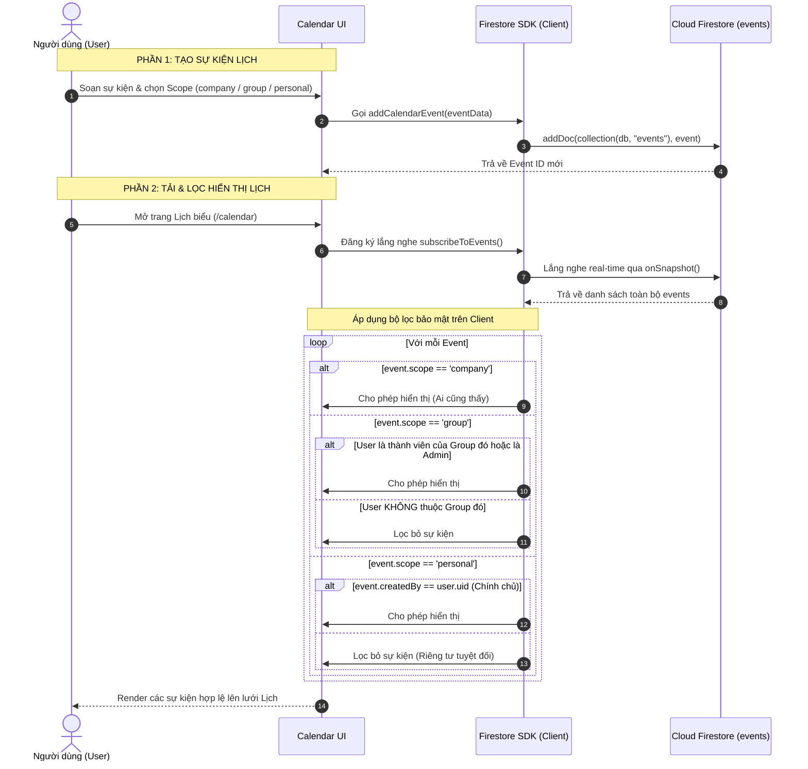
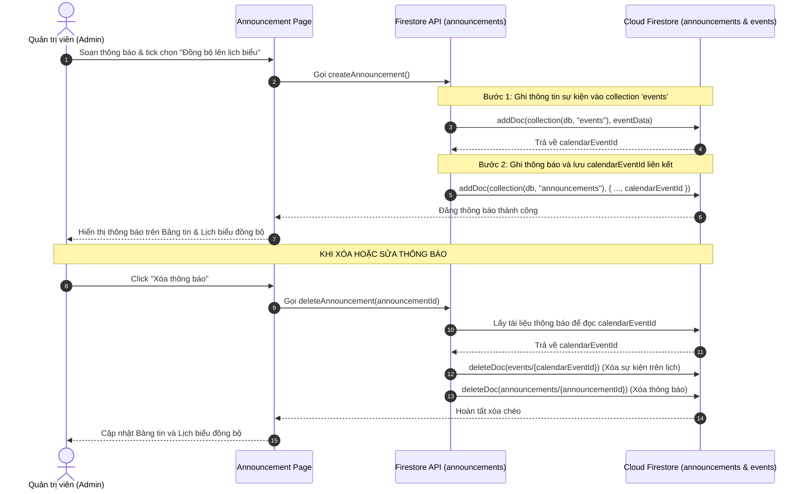
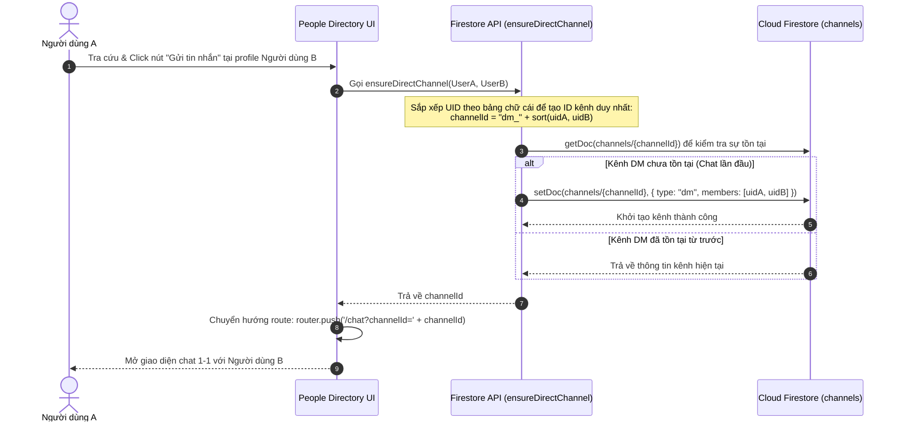

# Sơ đồ Luồng Nghiệp vụ / Hệ thống (Porocia Portal)

Tài liệu này tổng hợp toàn bộ các luồng nghiệp vụ và luồng xử lý dữ liệu cốt lõi của hệ thống **Porocia**. Bạn có thể sao chép trực tiếp mã **Mermaid** của từng sơ đồ dưới đây để dán vào **Draw.io** (chức năng **`+` (Insert) -> Advanced -> Mermaid...**) để tạo ra các sơ đồ tuần tự (Sequence Diagrams) có thể chỉnh sửa giao diện.

---

## 1. Luồng Xác thực & Cấp phát Session Cookie (Auth & Session Cookie Flow)
Mô tả quy trình đăng nhập phía Client, sinh mã Token, gọi Server Action để tạo HTTP-only Session Cookie và cơ chế kiểm soát Route của Middleware/Server Guard.

---

## 2. Luồng Gửi Tin nhắn & Cập nhật số Tin nhắn chưa đọc (Message Sending & Unread Flow)
Mô tả quy trình gửi tin nhắn, cập nhật danh sách thành viên kênh và tự động tăng số lượng tin nhắn chưa đọc của đối phương bằng một transaction/Batch ghi nguyên tử (Atomic).

---

## 3. Luồng Tải ảnh trực tiếp lên Cloudinary từ Wiki (Wiki Image Upload Flow)
Mô tả quá trình tải tệp ảnh từ Client lên Cloudinary bằng Unsigned Preset và chèn Token Markdown vào vị trí con trỏ của trình soạn thảo kèm các thông báo Toast.

---

## 4. Luồng Xóa bài viết & Dọn dẹp ảnh Cloudinary (Wiki Deletion Cleanup Flow)
Mô tả quá trình phân tích nội dung Markdown của bài viết Wiki trước khi xóa để tìm và dọn dẹp các tệp ảnh đính kèm đã lưu trên Cloudinary nhằm tối ưu hóa dung lượng.

---

## 5. Luồng Tạo sự kiện Lịch & Bộ lọc Phạm vi hiển thị (Calendar Event Visibility Flow)
Mô tả quy trình tạo sự kiện lịch với các Scope khác nhau và cơ chế lọc hiển thị an toàn ở tầng Client để đảm bảo thông tin cá nhân/nhóm được bảo mật.

---

## 6. Luồng Đồng bộ Thông báo & Lịch biểu (Announcement & Calendar Event Sync Flow)
Mô tả quy trình liên kết đồng bộ giữa việc tạo bài thông báo (Announcement) và tạo sự kiện trên lịch biểu (Calendar Event), bao gồm cả cơ chế cập nhật và xóa chéo.

---

## 7. Luồng Thiết lập Kênh nhắn tin trực tiếp 1-1 (Direct Messaging 1-1 Provisioning Flow)
Mô tả luồng kiểm tra và tự động khởi tạo phòng chat 1-1 (DM) giữa hai nhân viên khi thực hiện truy cập từ trang cá nhân hoặc danh bạ.

---
*Tài liệu luồng hệ thống được cập nhật vào ngày 2026-06-01*
