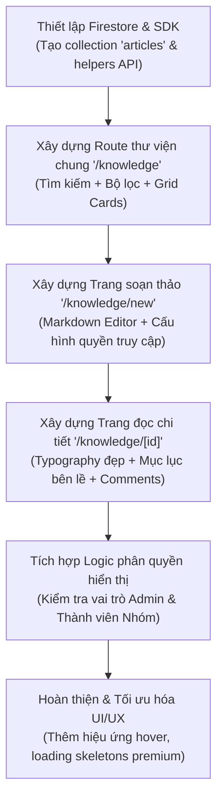

# 📚 Porocia Knowledge Base (ナレッジベース) - Thiết kế & Kế hoạch Triển khai

Chào mừng bạn đến với tài liệu thiết kế module **Knowledge Base (Thư viện Kiến thức & Quy trình Nội bộ)** cho cổng thông tin doanh nghiệp Porocia. Tài liệu này vạch ra tầm nhìn thiết kế cao cấp, cấu trúc cơ sở dữ liệu và lộ trình triển khai chi tiết.

---

## 1. Tầm nhìn & Mục tiêu (Vision & Goal)
*   **Mục tiêu**: Xây dựng một thư viện tài liệu nội bộ (Internal Wiki / Documentation Hub) giúp lưu trữ các quy trình làm việc chuẩn (SOP), tài liệu kỹ thuật, FAQs, hướng dẫn hội nhập cho nhân viên mới (Onboarding), và các chia sẻ kinh nghiệm nội bộ.
*   **Thiết kế cao cấp (Premium Aesthetics)**: Áp dụng ngôn ngữ thiết kế tối giản, sạch sẽ lấy cảm hứng từ Anthropic & Notion với gam màu ấm cúng (`#faf8f4`), font chữ sắc nét, hiệu ứng glassmorphism, và chuyển động mượt mà.

---

## 2. Các tính năng cốt lõi (Core Features)

### A. Phân loại Thư mục & Thẻ bài viết (Categories & Tags)
Phân chia tài liệu theo cấu trúc cây thư mục trực quan và các nhãn phụ để dễ tìm kiếm:
*   **人事・総務 (HR / General Affairs)**: Quy chế công ty, chính sách bảo hiểm, ngày nghỉ lễ.
*   **開発・技術 (Engineering / Technical)**: Tài liệu kiến trúc dự án, quy chuẩn viết code (Coding Guidelines), quy trình deploy.
*   **デザイン (Design)**: Design system, bộ nhận diện thương hiệu, assets.
*   **オンボーディング (Onboarding)**: Hướng dẫn dành riêng cho thành viên mới bắt đầu ngày đầu tiên.
*   **営業・マーケ (Sales & Marketing)**: Pitch decks, tài liệu giới thiệu sản phẩm.

### B. Trình soạn thảo & Trình đọc chuyên nghiệp (Premium Editor & Viewer)
*   **Markdown Editor**: Cho phép viết tài liệu bằng cú pháp Markdown hoặc Rich WYSIWYG đơn giản, hỗ trợ bôi đậm, danh sách, bảng biểu, ảnh minh họa và khối code có highlight cú pháp.
*   **Table of Contents (Mục lục tự động)**: Tự động quét các thẻ tiêu đề (`H2`, `H3`) trong bài viết để dựng menu mục lục trượt bên phải, giúp độc giả click nhảy nhanh đến phần mong muốn.
*   **Thống kê thời gian**: Tự động tính toán thời gian đọc (ví dụ: `⏱️ Đọc trong 3 phút`) và số lượng lượt xem bài viết (`👁️ 145 lượt xem`).

### C. Phân quyền hiển thị bài viết (Access Control)
Bảo mật tài liệu chặt chẽ dựa trên vai trò:
*   `公開` (Public - Toàn tổ chức): Bất kỳ ai đăng nhập vào hệ thống đều đọc được.
*   `グループ限定` (Group Restricted): Chỉ những thành viên thuộc Nhóm chuyên biệt (ví dụ: Nhóm `開発チーム`) mới có quyền truy cập bài viết. Người ngoài nhóm không nhìn thấy.
*   `管理者限定` (Admin Only): Tài liệu lưu trữ nội bộ dành riêng cho cấp quản lý.

### D. Tương tác & Phản hồi (Social Collaboration)
*   **Bài viết yêu thích (Favorites / Bookmark)**: Cho phép nhân viên lưu nhanh các quy trình quan trọng (như quy trình xin nghỉ phép, thông tin tài khoản dùng chung) lên trang cá nhân để xem lại bất cứ lúc nào.
*   **Thảo luận dưới bài viết (Comments Section)**: Đồng nghiệp có thể để lại thắc mắc hoặc bổ sung thông tin dưới dạng bình luận có phân cấp dưới chân mỗi tài liệu.

---

## 3. Cấu trúc Cơ sở dữ liệu (Firestore Schema)

Chúng ta sẽ khởi tạo một Collection mới trên Firestore có tên là **`articles`** với cấu trúc tài liệu như sau:

```typescript
interface Article {
  id: string;
  title: string;          // Tiêu đề bài viết
  content: string;        // Nội dung chi tiết (định dạng Markdown / HTML)
  summary: string;        // Tóm tắt ngắn hiển thị ở danh mục
  category: string;       // hr | engineering | design | onboarding | sales
  tags: string[];         // Nhãn phụ (ví dụ: ['nextjs', 'sop', 'policy'])
  
  // Quyền hạn truy cập
  scope: 'all' | 'group' | 'admin';
  allowedGroups?: string[]; // IDs của các Group được phép xem bài viết nếu scope === 'group'
  
  // Thống kê & Tương tác
  views: number;          // Số lượt đọc
  likes: string[];        // Danh sách UIDs của những người bấm Thích bài viết
  
  // Tác giả
  createdBy: string;      // UID tác giả
  authorName: string;     // Tên hiển thị của tác giả để load nhanh
  authorPhoto?: string;   // Ảnh tác giả
  
  createdAt: any;         // Thời gian tạo
  updatedAt: any;         // Thời gian cập nhật gần nhất
}
```

---

## 4. Giao diện Người dùng dự kiến (UI/UX Wireframe Routes)

Module sẽ hoạt động độc lập dưới route `/knowledge` với 3 trang chính:

### 🏠 Trang thư viện chung: `/knowledge`
*   **Phần trên**: Ô Tìm kiếm lớn nằm chính giữa với thiết kế tối giản, kèm các nút lọc nhanh danh mục dạng "Pill filters" (tương tự như trang Members và Chat).
*   **Phần dưới**: Bố cục chia làm 2 cột:
    *   *Cột bên trái (25%)*: Danh mục thư mục cây dạng thư mục thông minh.
    *   *Cột bên phải (75%)*: Danh sách các Card tài liệu dạng lưới 3 cột. Card bài viết hiển thị tiêu đề, tóm tắt ngắn, ảnh tác giả, danh mục và lượt đọc cực kỳ sang trọng.

### 📖 Trang xem chi tiết tài liệu: `/knowledge/[articleId]`
*   Giao diện đọc tối ưu hóa tiêu điểm (Distraction-free reading mode).
*   Cột chính giữa hiển thị nội dung bài viết với typography sắc nét, dễ đọc.
*   Cột bên phải hiển thị Mục lục bài viết tự động di chuyển theo vị trí cuộn trang.
*   Dưới cùng là phần Thảo luận & Hỏi đáp trực quan cho nhân viên.

### ✍️ Trang soạn thảo tài liệu: `/knowledge/new` (Và `/knowledge/[articleId]/edit`)
*   Giao diện chia đôi thông minh (Split-Screen Editor): Bên trái nhập mã Markdown, bên phải render thành phẩm đẹp mắt thời gian thực.
*   Form cấu hình chuyên nghiệp: Chọn danh mục, nhập tóm tắt và đặt quyền hạn truy cập (Công khai / Group / Admin).

---

## 5. Lộ trình Triển khai Chi tiết (Development Roadmap)



### 🗓️ Kế hoạch chi tiết từng bước:
1.  **Bước 1 (Backend/API)**: Khởi tạo tệp `src/lib/firebase/knowledge.ts` chứa các hàm:
    *   `getAllArticles(userGroups, isAdmin)`: Tải bài viết được phép xem.
    *   `createArticle(data, uid)`: Lưu bài viết mới.
    *   `updateArticle(id, data)`: Cập nhật bài viết.
    *   `likeArticle(id, uid)` / `incrementViews(id)`: Các tương tác phụ.
2.  **Bước 2 (Route /knowledge)**: Tạo trang thư viện bài viết, tích hợp thanh tìm kiếm mượt mà và bộ lọc danh mục.
3.  **Bước 3 (Editor /new)**: Tạo trang soạn thảo bài viết chuyên nghiệp, tích hợp package render Markdown.
4.  **Bước 4 (Viewer /[id])**: Tạo trang đọc bài viết tập trung, có hỗ trợ mục lục tự động và phần thảo luận cuối trang.
5.  **Bước 5 (Security Rules)**: Cập nhật Firestore Security Rules để đảm bảo chỉ những người được cấp quyền mới có thể truy cập thực tế vào dữ liệu của bài viết.

---

*Tài liệu này được biên soạn nhằm chuẩn bị nền tảng hoàn hảo trước khi bắt tay vào code thực tế. Khi bạn đã sẵn sàng, hãy cho tôi biết để chúng ta cùng bắt đầu triển khai từng bước nhé!*
